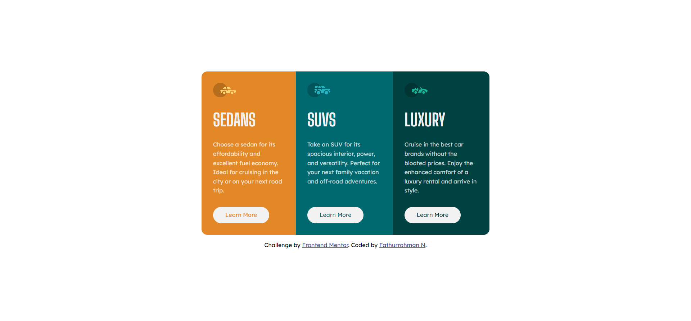

# Frontend Mentor - 3-column preview card component solution

This is a solution to the [3-column preview card component challenge on Frontend Mentor](https://www.frontendmentor.io/challenges/3column-preview-card-component-pH92eAR2-). Frontend Mentor challenges help you improve your coding skills by building realistic projects.

## Table of contents

- [Overview](#overview)
  - [The challenge](#the-challenge)
  - [Screenshot](#screenshot)
  - [Links](#links)
- [My process](#my-process)
  - [Built with](#built-with)
  - [What I learned](#what-i-learned)
- [Author](#author)

**Note: Delete this note and update the table of contents based on what sections you keep.**

## Overview

### The challenge

Users should be able to:

- View the optimal layout depending on their device's screen size
- See hover states for interactive elements

### Screenshot

#### Desktop

#### Phone

#### Active State

### Links

- Solution URL: [source code](https://github.com/fath-nasrudin/preview-card)
- Live Site URL: [live site](https://fath-nasrudin.github.io/preview-card)

## My process

### Built with

- SCSS
- Flexbox
- Mobile-first workflow

### What I learned

I build this project to learn preprocessor and SASS.

## Author

- Frontend Mentor - [@fath-nasrudin](https://www.frontendmentor.io/profile/fath-nasrudin)
- Twitter - [@fathnas\_](https://www.twitter.com/fathnas_)
